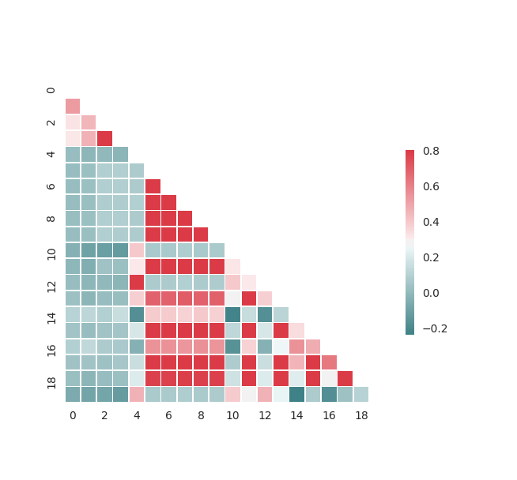

# Activity 1. Principal Component Analysis

## 1. Load the data assigned
Observing the data file, we have decided to obtain the necessary data from it 
without changing the original file. A filter is going to be used in order to 
obtain the data corresponding to San Juan city between January 1990 and January
1996.

The first 4 columns of the data file are only used for identifying the different
data records, therefore, they have not been used as features. Some rows do not
include all the data, consequently, a zero value has been inserted in that 
features.

## 2. Extract the correlation among features
The feature 4 is the 'precipitation_amt_mm' wich is the 
total precipitation measured by PERSIANN satellite. This one has correlation coefficient 
of 1 with feature 12 that is the total precipitation measured by the NOAA's 
NCEP Climate Forecast System Reanalysis. 

Also we need to remark that the features 5, 6, 7, 8 and 9 has correlation 
between them. The features are: mean air temperature, average air temperature, 
mean dew point temperature, maximum air temperature and minimum air temperature 
respectively. All these features are measured by the NOAA's NCEP System and has 
in common that are temperatures and by consequence the correlation coefficient 
is one.

## 3. Execute PCA and plot the results
Principal component analysis (PCA) is a popular technique for dimensionality 
reduction. PCA is an orthogonal linear transformation that turns a set of 
possibly correlated variables into a new set of variables that are as 
uncorrelated as possible.

The data is normalized using the MinMaxScaler before executing the PCA analysis.
This will avoid the possibility of some features having more weight than others.

Once the PCA has been executed, the results has been plotted. There, two 
outliers can be clearly observed. They correspond with the rows 141 and 89 of
the data file. This is due to the fact that they do not have enough features
(maybe due to a bad data recopilation).

