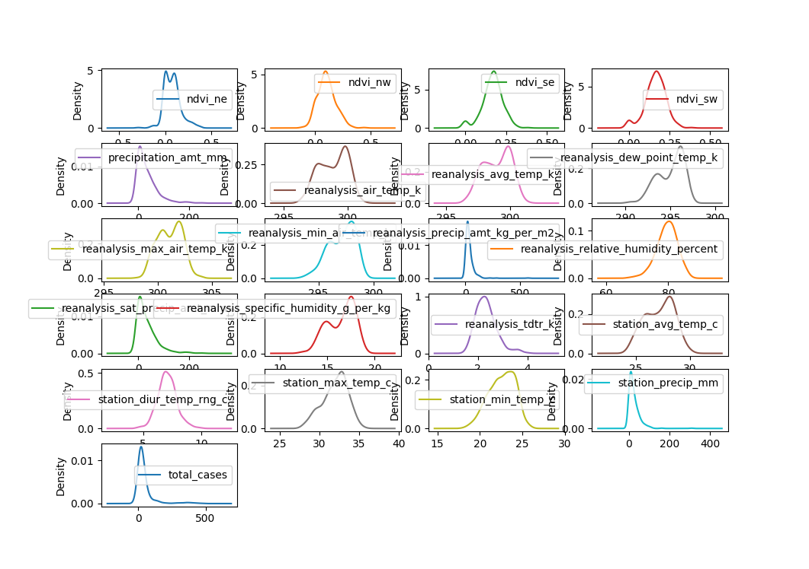

# Activity 4. Decision Trees for Regression

## 1. Correlation between features and total cases.
For the study of the correlation between the features and the total cases we used the Pearson correlation coefficient which allows us to know the existing linear relationship between the different features with the total cases. Following this way we will obtain a global vision of how the features are related (remember that a low relation does not imply that these features are not influential for the prediction, only that they are not related in a linear way).

In our case it can be observed how some features present a high correlation, the strongest being the features provided by the vegetationsatellite data, there are also quite weak relationships in the case of reanalysis_precip_amt_kg_per_m2 or
reanalysis_relative_humidity_percent which indicates that there is no direct relationship between features and total cases.

## 2. Feature Selection
This is the most critical part, since it will depend on it if our model is able to achieve more accurate predictions.

In order to decide which features will be removed first, we must use some graphics that provide us knowledge of how our data are distributed. To study the data we will be helped by density charts that provide us information that allows us to discard features with a similar distribution. In our case this is very well appreciated in the graphics of ndvi_ne, ndvi_nw, ndvi_se and ndvi_sw, from which we decided to eliminate all except ndvi_se. This feature also presents a greater correlation with the total cases, as it has been seen in the first graph of this file. From this image, it is remarkable how all the precipitations density graphs follows the same distribution as the total number of cases. For selecting the the accurate feature of precipitations, we will use the Clustering features graph described in this section.

We must also have into account how our features are distributed in the clustering that we have just finished in the Activity 3. In this graph you can see how similar are the features and gives us extra information that will lead us to make choices of features. As it can be seen in the previous image, the precipitations has the same distribution as the total number of cases. With the clustering graph will help us to decide if we should stay with precipitation_amt_mm or choose station_precip_mm in representation of precipitation feature.

## 3. Build a Decision Tree Model
Through these mechanisms we will try to deduce together with the previously selected features, how accurate our prediction will be, for this we must first create the decision tree indicating that in our case we want the criterion to be 'mse' (mean squared error), together with the depth that we will reach, to avoid overtraining our data and overfiting occurs we have to calculate, before we have to calculate the best value of max_depth for our data.for this we will need to carry out the cross-validation in order to avoid overfitting, what we do with this is to select subsets of our data and test it with another set of data to finally reach a representation of the best values for max_depth of way that as we can see in our case is 2 which is the lowest value.

## Authors
* José Ángel Martín Baos
* Oscar Pérez Galán
* Miguel Ampuero López-Sepúlveda
