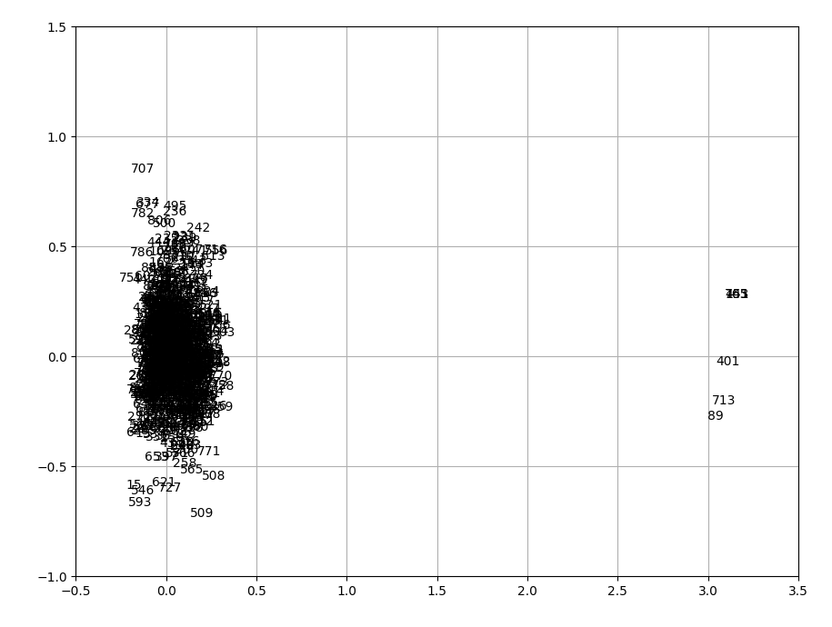
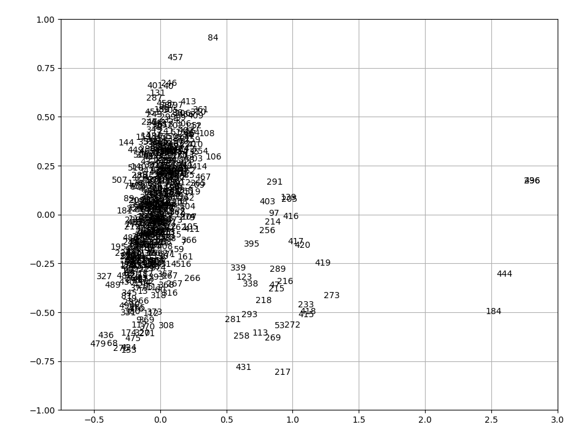
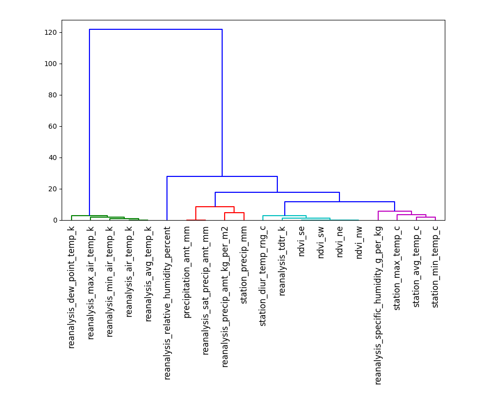
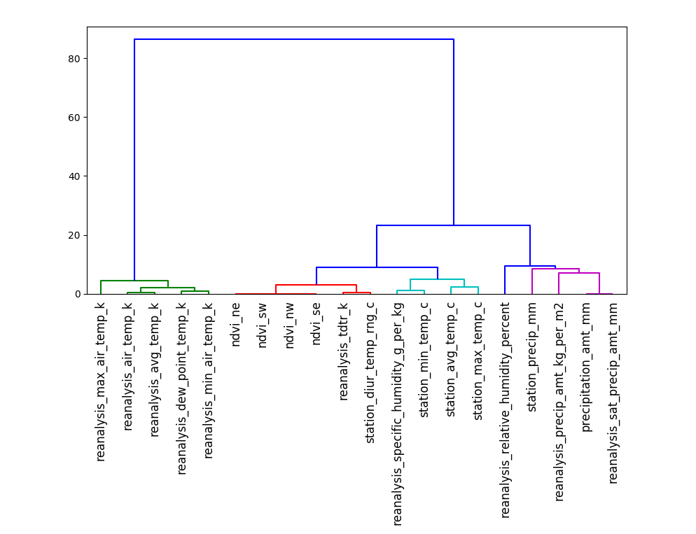
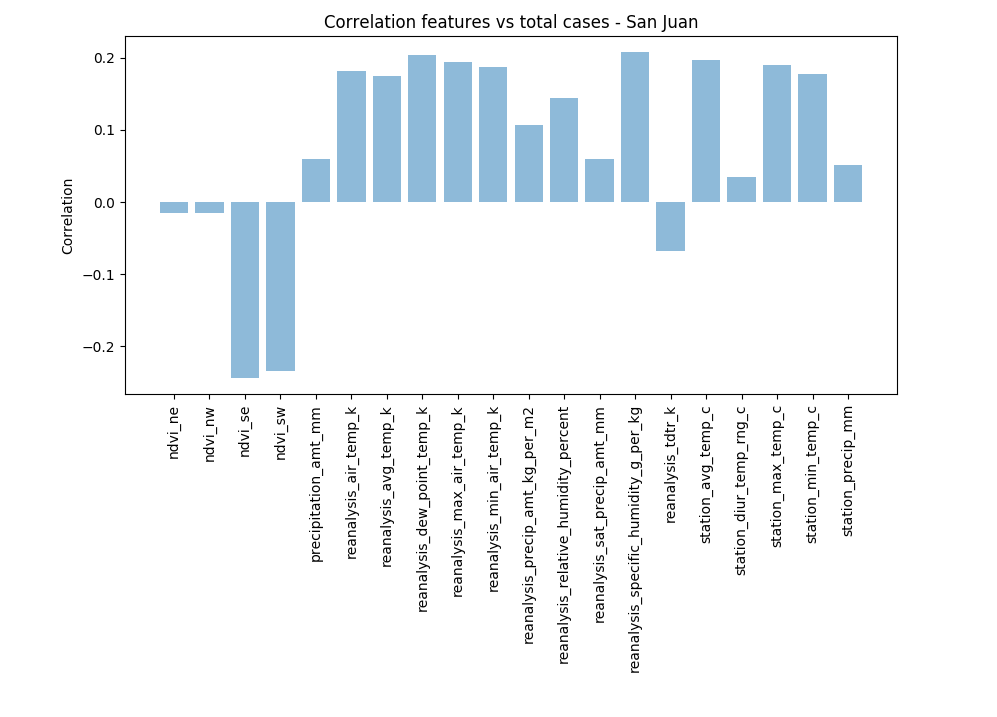
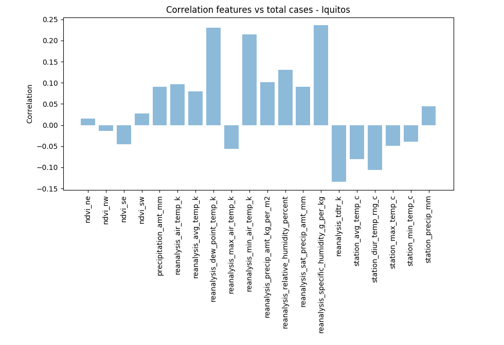

# Activity 5. Feature Engineering

## 1. Identify outliers
The first thing we should consider in this new phase of our project is to identify and eliminate outliers as we did in activity 1, to achieve this goal we must remember that once we have the data loaded and normalized we must make a PCA estimate that shows us graphic form in 2 dimensions which are the outliers.

If we perform this process with San Juan data, now with all the data on it, we can easily see in the graph which would be the outliers, which for this case would be 89,141,401,453,713 and 765 which will be eliminated to continue with the procedure .

The same scheme we would have to continue to analyze the data of Iquitos, obtaining the following outliers,184,236,444,496.

## 2. Hierarchical clustering algorithm using features as elements
Once we have cleaned our data we can start working with them, so if we want to execute hierarchical clustering we have to normalize the data again, but in this case using the transpose when dealing with features, the calculations are the same as in the activity 2, so we will first calculate the similarity matrix with a "Euclidean" metric.

Once the similarity matrix is obtained, we have to generate the dendrogram for which we use the "complete" method, which we know is solid.

Now is the time to decide on what point to cut our dendrogram, according to our observations for San Juan we have decided to establish the cut in 9, which generates 5 clusters as a consequence.

For Iquito data, the chosen cut is 9 as well, with a total of 5 clusters.

## 3. Correlation between features and total cases
Once known how clusters are grouped we have to start studying the correlations between these and the total cases, for that we select all the features and apply a Pearson correlation with which we will obtain a graph that allows us to distinguish the direct relationship between the features and the total cases, as was done in activity 4, this is the result for San Juan:

As expected, the most important features of activity 4 continue to be important when analyzing all the data. we see for example the importance that the satellite of vegetation continues to have.

In the case of Iquitos, we see how the datas collected by the vegetation satellites are not relevant.

## 4. Feature selection

## Authors
* José Ángel Martín Baos
* Oscar Pérez Galán
* Miguel Ampuero López-Sepúlveda
