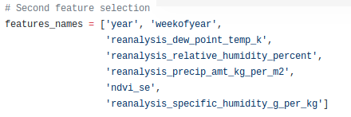

# Activity 5. Feature Engineering

## 1. Identify outliers
The first thing we should consider in this new phase of our project is to identify and eliminate outliers as we did in activity 1, to achieve this goal we must remember that once we have the data loaded and normalized we must make a PCA estimate that shows us graphic form in 2 dimensions which are the outliers.

If we perform this process with San Juan data, now with all the data on it, we can easily see in the graph which would be the outliers, which for this case would be 89,141,401,453,713 and 765 which will be eliminated to continue with the procedure .

The same scheme we would have to continue to analyze the data of Iquitos, obtaining the following outliers,184,236,444,496.

## 2. Hierarchical clustering algorithm using features as elements
Once we have cleaned our data we can start working with them, so if we want to execute hierarchical clustering we have to normalize the data again, but in this case using the transpose when dealing with features, the calculations are the same as in the activity 2, so we will first calculate the similarity matrix with a "Euclidean" metric.

Once the similarity matrix is obtained, we have to generate the dendrogram for which we use the "complete" method, which we know is solid.

Now is the time to decide on what point to cut our dendrogram, according to our observations for San Juan we have decided to establish the cut in 9, which generates 5 clusters as a consequence.

For Iquito data, the chosen cut is 9 as well, with a total of 5 clusters.

## 3. Correlation between features and total cases
Once known how clusters are grouped we have to start studying the correlations between these and the total cases, for that we select all the features and apply a Pearson correlation with which we will obtain a graph that allows us to distinguish the direct relationship between the features and the total cases, as was done in activity 4, this is the result for San Juan:

As expected, the most important features of activity 4 continue to be important when analyzing all the data. we see for example the importance that the satellite of vegetation continues to have.

In the case of Iquitos, we see how the data collected by the vegetation satellites are not relevant.

## 4.1 Feature selection without decision tree
At this point, we must begin to make decisions and proceed to eliminate features that according to our criteria are not relevant, for the selection of features we have decided to use a pair of features for each cluster of the dendrogram.

In the case of San Juan we found 5 clusters and now it is up to us to select at least 2 characteristics for each cluster, always selecting the ones with the highest relevancy, in order to know the relevance that each feature has, we have to rely on the graph of the correlations between features and total cases, if we look at it, we see how the correlations are quite similar to those performed in activity 4, obtaining for example as an important feature ndvi_se (east vegetation satellite), inside the first cluster starting from the left of the dendrogram.

In Iquitos, the data present different conclusions, since the correlations between the features and the total cases are not similar, so we can see how in Iquitos the vegetation satellite features only provide correlated data, so that according to our criteria they would not be so important as others, but always that you have to select at least 2 from each cluster. In Iquitos the most relevant features are found in reanalysis_dew_point_temp_k and in reanalysis_specific_humidity_g_per_kg, which under our criteria will be good features to carry out the prediction.

## 4.2 Feature selection with decision tree
With the decisions made so far we have made an important selection of the features, but now we are going to try to go a little deeper into this selection and try to reduce the number of selected features. For this objective, we need to help us with the decision trees, which, as we saw in Activity 4, provide us with values about the relevance of the features, which should not be confused with the correlation.For this new selection of features we adopt a new criterion that says that for each pair of features belonging to the same cluster the most relevant one will be chosen and if both present a relevance of 0, the feature with the most correlation will be chosen.

For each case it is necessary to do the calculation of the max depth, which will be the one that gives us some values of the precise features and without overfitting.

In the case of San Juan, we have been able to verify that according to our new criterion of the two features of the vegetation satellite cluster we only need the feature ndvi_se, since for ndvi_sw the relevance is 0

In the case of Iquitos we can see that within the third cluster starting from the left the features reanalysis_specific_humidity_g_per_kg and station_avg_temp_c have a relevance greater than 0 but the relevance of station_avg_temp_c is greater than that of humidity therefore, we chose the feature station_avg_temp_c.

## Authors
* José Ángel Martín Baos
* Oscar Pérez Galán
* Miguel Ampuero López-Sepúlveda
