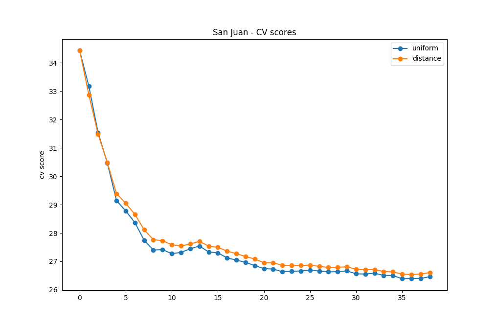
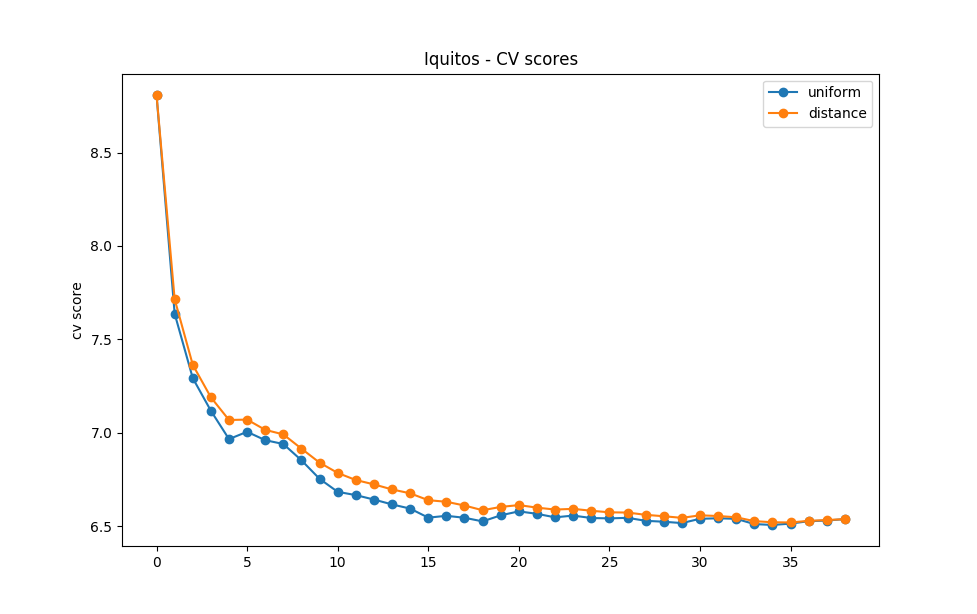
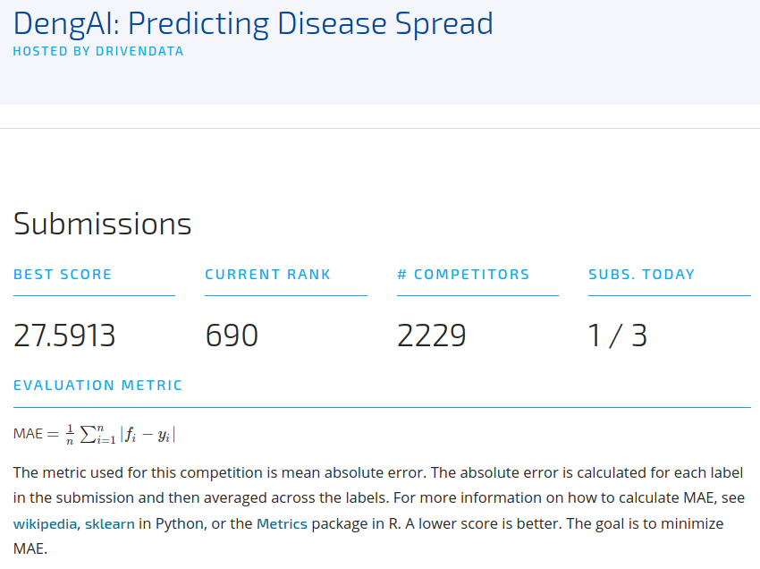

# Activity 6. Predictive Model Building
At this point of development, it is time to start predicting, previously we have done a data analysis work to see how they are grouped and related together with a selection of features according to the criteria we have considered appropriate.

## Missing Values
The first thing to consider is that values ​​of our data set are useful, therefore if we look at the data we can see how some of them do not present any field with data, or have little data. With this information we have decided that it can be really useful to do an interpolation of the data, getting no empty field, therefore we will get a better approximation to the reality of the data and be able to carry out a better analysis of them and therefore a better prediction.

we have to remember that as we saw, we had outliers and now they have data, but as we believe that they are going to make the analysis worse, since they are fictitious data that do not reflect the reality then we are going to eliminate them.

## Feature Selection
The selection of features is the same as we chose in activity 5, so there is no modification here.

## Parametrization
Once we have the clear data and features, we must parameterize the data according to some criteria, for this occasion we have decided not to normalize the data, since by doing tests we have seen that the CV value is better without normalization, which can mean that the selection of features is not entirely correct

The cross validation analysis is performed with 2 values for weights (uniform and distance), where we will use the Neighbors-based regression model, once both weights are finished, we can see the CV values obtained, observing a better result using uniform, as we see for the case of San Juan,in which we see that the best CV value is reached when the number of neighbors is 35.

Or in the case of Iquitos,that reaches its best CV when a neighbor value equal to 18 is used.

## Execute kNN and make predictions
We already know the best number of neighbors for each case and the best weight, so that we can start making predictions based on those values obtained previously, so we execute the KNN and we make the prediction of the features of each city with the labels of each.

The predictions will be rounded to avoid losing information, and once completed they will be saved in the file result.to_csv.

## Participating in the competition
Once the predictions are finished and we have obtained the result csv file, we are ready to start participating in the competition, so we have done a test to be able to orient ourselves and consider possible modifications on our decisions.

After uploading the file to the competition this was our score:

## Authors
* José Ángel Martín Baos
* Oscar Pérez Galán
* Miguel Ampuero López-Sepúlveda
