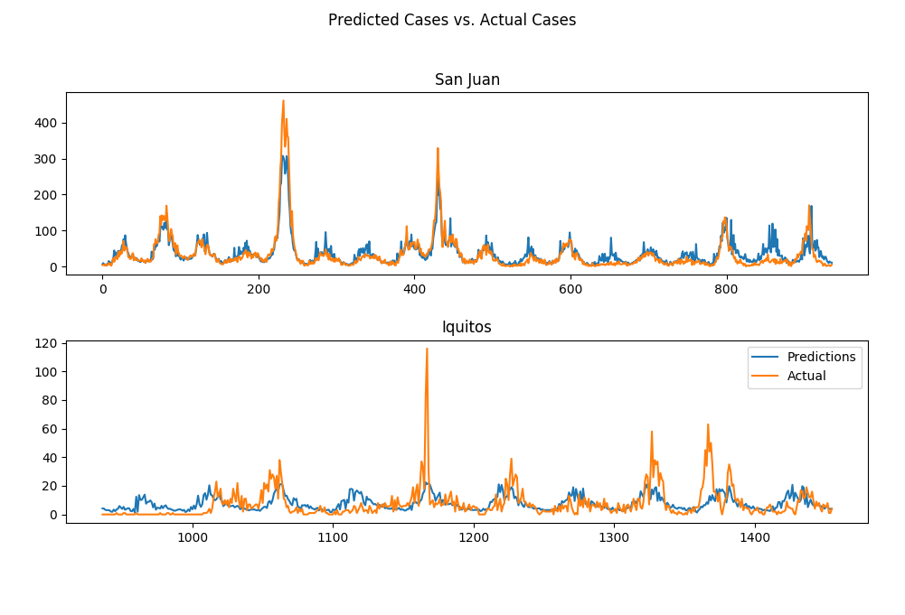
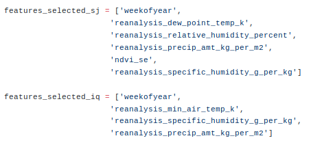
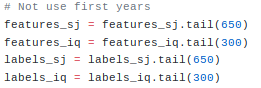
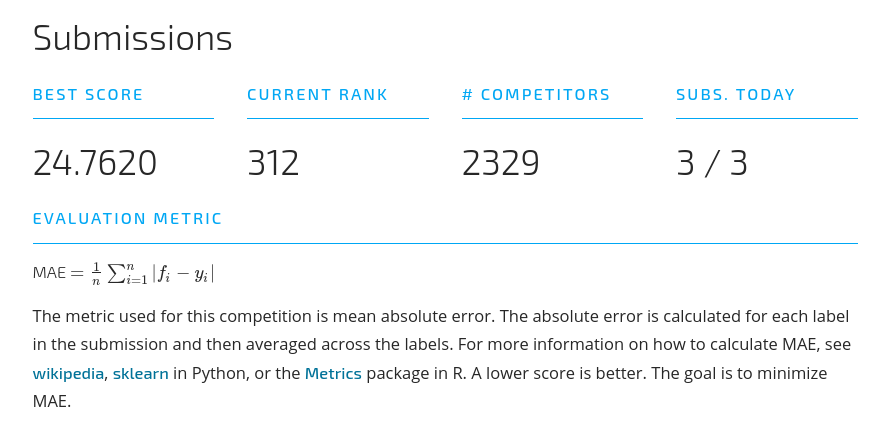

# Activity 7. Submission

# Improving Predictions
This will be our final part of the project, as we have seen in previous activities we have made a series of studies on the data and algorithms that allow us to choose the best ways to make our predictions as correct as possible.

In this last activity we will carry out improvements on what is known so far, we will also discuss new approaches that help us with these improvements. Some of the mainlines of improvement applied are:
* Back-Testing.
* Testing several algorithms.
* Normalization of the data.
* New selection of features.
* Using only the last years to fit the algorithm.

Some of this improvements are going to be explained.

# Back-Testing
In general terms, is the process of testing a strategy before implementing it. It allows us to know if the approach we are using is correct or not.  To accomplish this function we work with our local data. We have made a division in two subsets, one for training and other one for testing. The selection is proportional to the data we have from each city. That is the reason the subset of training is bigger in San Juan than Iquitos, due to we have more records of the first city. With this method we are able to predict our own data. Even we already know the accurate result, the goal of this section is to verify that our predictions are correct.

With the algorithms used and trained in the back-testing, we have made a prediction over the whole dataset. The predicted results and the real dengue cases for San Juan and Iquitos can be shown in the following image.

# New selection of features
As we said, we are going to try to improve our results, so it is necessary to see where the prediction problems are. One of the most relevant factors for predictions is the study and selection of the features.

If we observe the set of features we obtained in activity 6 for Iquitos, we observe that the number of features is quite high. This can be a problem since the less relevant features could generate noise in the study of the set of features. For this reason we have taken the decision to eliminate some features based on their relevance, even if some cluster groups of features generated in previous activities are left without a representative feature. In this way we can reduce that noise, and therefore get the improvement we were looking for.

One of the features that was in both sets has been the "year", this feature generates a high distortion in the data, and really is not a feature that helps predict better, therefore it has been eliminated from multiple sets of features.

This new set of features more reduced should be able to eliminate the problem we had of noise between features, and help us improve with our predictions

# Using only the last years to fit the algorithm
We have observed that the number of cases are lower in the last few years, therefore, we have figured that the first year might be causing error in the prediction. To solve this problem we make a selection of the last data of each set which, as we have seen in our tests, would be the last 650 data of San Juan and the last 300 of Iquitos.

This has been one of the key improvements to reduce the error when predicting, demonstrating that effectively the first data elements generate worse results and cause distortion.

# Algortihm changes
After the successive modifications applied to the set of data, we have to train and make predictions, but we are also going to make some changes in this section,depending on the city.

San Juan modifications:

The first one will change the classifier for the San Juan data set, choosing for it the Random Forest, since after tests on the obtained results we have seen that this type of classifier provides better results. In the tests we have determined that the best number of estimators for our data is 50, if we increase this value, the prediction might be improve, but the computational cost will be too big. Moreover, since we have established the maximum depth to None (in order to allow each of the individual trees to overfit), then the memory consumption will be too high.

Iquitos modifications:

In the case of Iquitos, it will remain the same as activity 6, except that now we carry out a normalization on the data. We believe that this normalization is necessary since we have data with different measurement scales. Therefore, we will execute a normalization process using the MaxAbsScaler. We will also modify the weight scheme parameter to "distance", which is the one with which we obtained a better result.

# New submissions results
Now we just have to save the predictions made on a .csv file and submit the competition to see our new score and see if we really have improved.

## Authors
* José Ángel Martín Baos
* Óscar Pérez Galán
* Miguel Ampuero López-Sepúlveda
