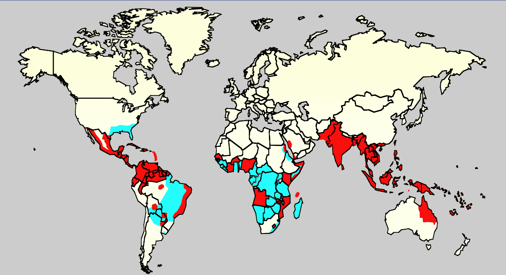

# Machine Learning Techniques - Predicting Dengue Disease Spread
In this repository we will use Machine Learning Techniques for studying the problem of Dengue in South America. But, first of all: What is Machine Learning? Machine Learning is the use of artificial intelligence for giving the ability to learn and improve from different sources of data.

Then, what is dengue? Dengue fever is fast pandemic viral disease that occurs in tropical and sub-tropical parts of the world and which is spread through mosquitoes. As it is carried by mosquitoes, the transmission dynamics of the dengue are related to climate variables such us temperature and precipitation.

Dengue distribution in the year 2006:

In our case, this project is focused in the data of two cities of South America. We will study the different climate registers of San Juan (Puerto Rico) and Iquitos (Peru). We hypothesize that in each city, the pattern dengue follows can change, therefore, we will split both cities. In this repository you will find different activities related to the subject of Machine Learning Techniques, organized in folders. Also, this git repository contains all the necessary code to complete the Driven Data [competition](https://www.drivendata.org/competitions/44/dengai-predicting-disease-spread/) about this topic. This Driven Data competition want us to predict the disease spread by studying previous data given by them.

## Activities
- [Activity 1 - Principal Component Analysis](Activity_1/)
- [Activity 2 - Hierarchical Clustering](Activity_2/)
- [Activity 3 - K-means](Activity_3/)
- [Activity 4 - Decision Trees for Regression](Activity_4/)
- [Activity 5 - Feature Engineering](Activity_5/)
- [Activity 6 - Predictive Model Building](Activity_6/)
- [Activity 7 - Submission](Activity_7/)

## Software
The scripts presented in this repository has been coded using Python 2.7.
Some libraries are also necessary in order to run these scripts, such as:
* Numpy
* Scipy
* Pylab
* Seaborn
* Matplotlib
* Sklearn

## Authors
* José Ángel Martín Baos
* Oscar Pérez Galán
* Miguel Ampuero López-Sepúlveda

----------------------------------------------------
Machine Learning Techniques - 2017  
Faculty of Computer Science  
University of Castilla-La Mancha (Spain)
